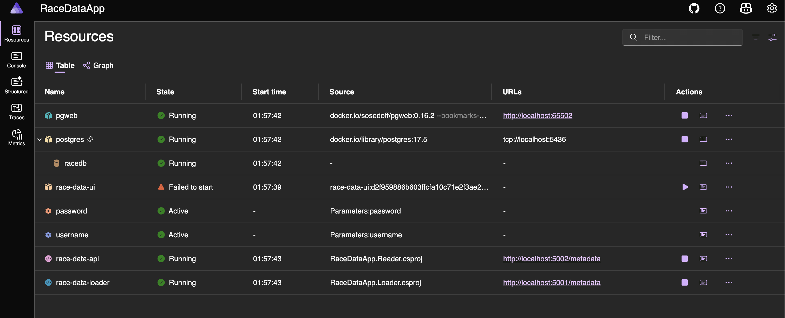
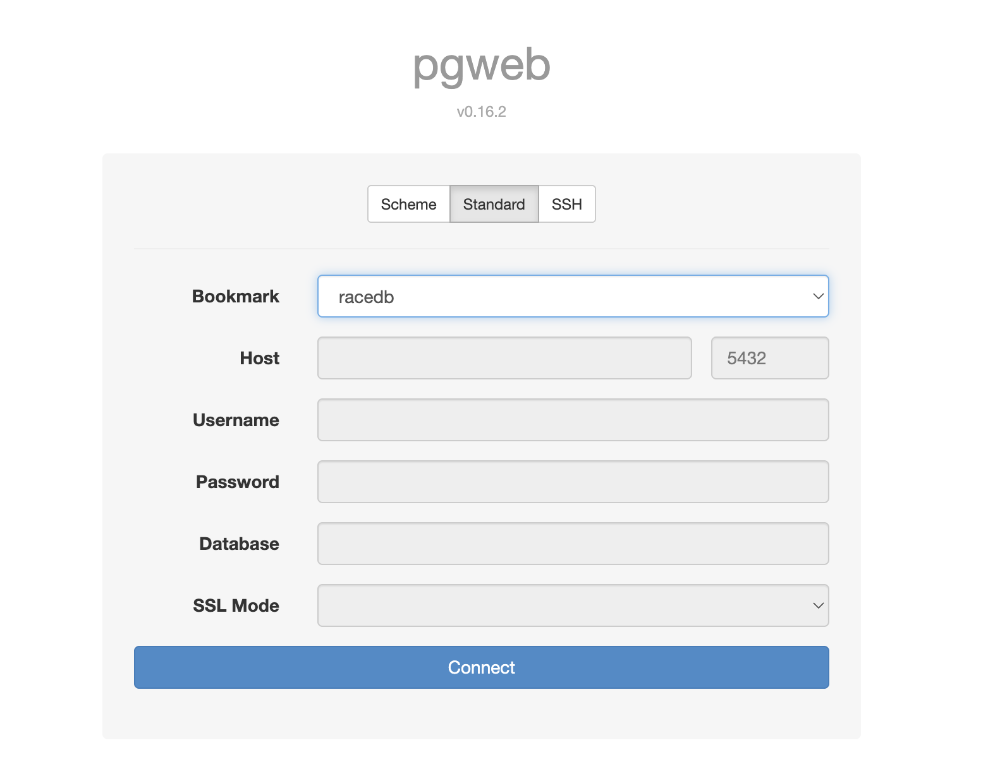
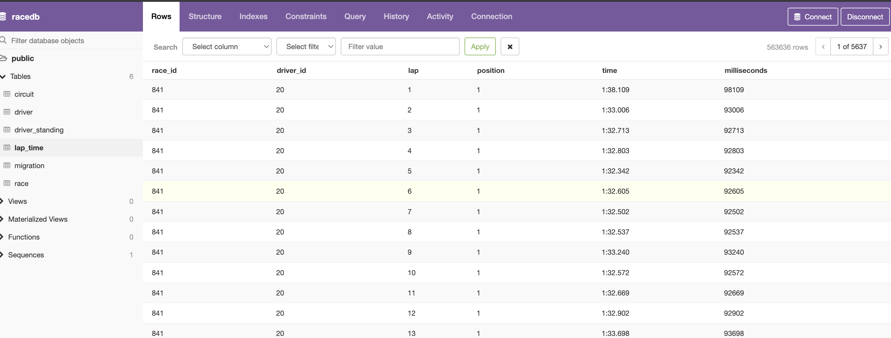

# williams-racing

## Prerequisites

Docker daemon running (Aspire requires it)

## How to run 

`RaceDataApp.AppHost` is the Aspire orchestrator, which will spin up all the services. THe first time you run it, it will take quite abit of time for the data to be persisted to the DB.

The Aspire dashboard should pop up and you can view the different resources in there.

you can click on pgweb to view the data (once it's loaded - it will take some time). Select `racedb` and click Connect

Once the migration has completed, it should look like this

There is an API with two endpoints exposed on port `:5002`

localhost:5002/circuit-summary
localhost:5002/driver-summary

for, respectively:
- A summary per circuit including circuit details, fastest lap across all races and total races completed.
- A summary per driver including number of times they have been on the podium and the total number of races entered.

When calling via e.g. Postman make sure you add the following header

`Accept: application/json`

otherwise the output will look :poo:

## Design

I've used ServiceStack to design the backend. No good reasons, I just used it before and could move pretty quickly with it. 
Given the time constraints I have, I went with it (I would actually not recommend anyone using ServiceStack.. it's nice 
and all but poorly documented and run by one guy)

There are two services:
- The `Loader` - basically it's just a migration script, it loads up the CSV data and insert it into Postgres
- The `Reader` - that's the API, it's got 2 methods to return
   - A summary per circuit including circuit details, fastest lap across all races and total races completed.
   - A summary per driver including number of times they have been on the podium and the total number of races entered.

There is an _extremely bare bone_ frontend, that's just an Angular app that talks to the `Reader` service. 

ALl of this is orchestrated together by `Aspire` (it's a Docker compose ++ basically). This will spin up the Postgres database
for you in a Docker container, as well as the other 2 services (and the frontend)

## Improvements

It's taking ages to load up the `lap_time` (a good minute or two), There are ways of making this faster but I ran out of time.