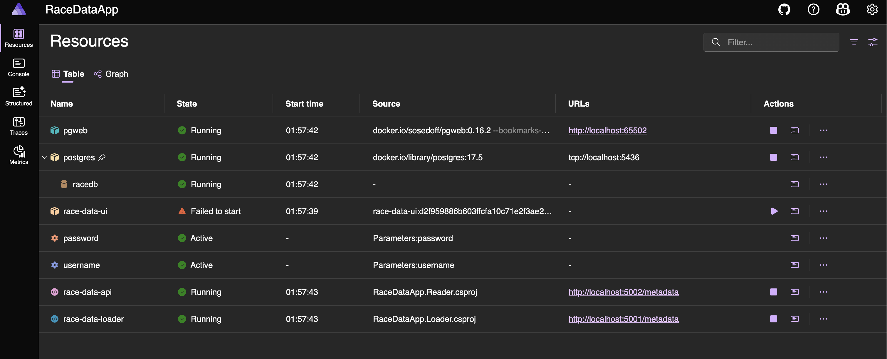
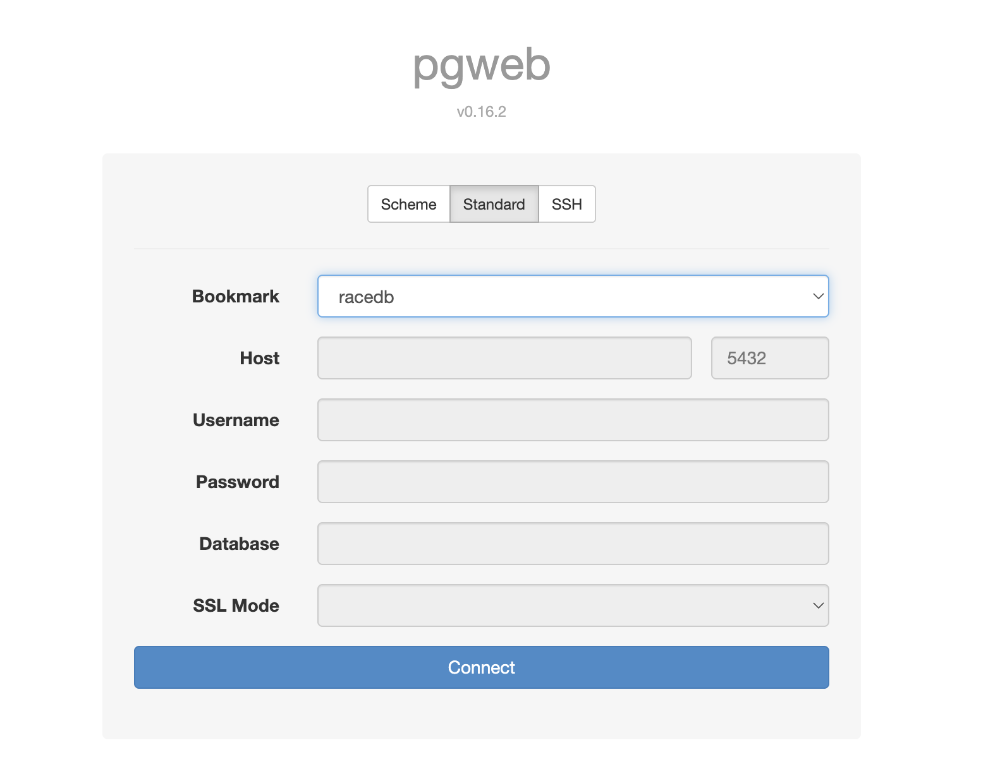
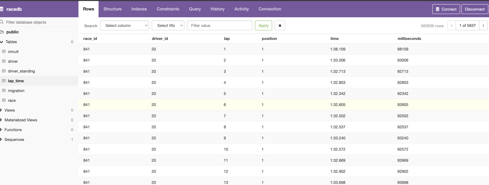
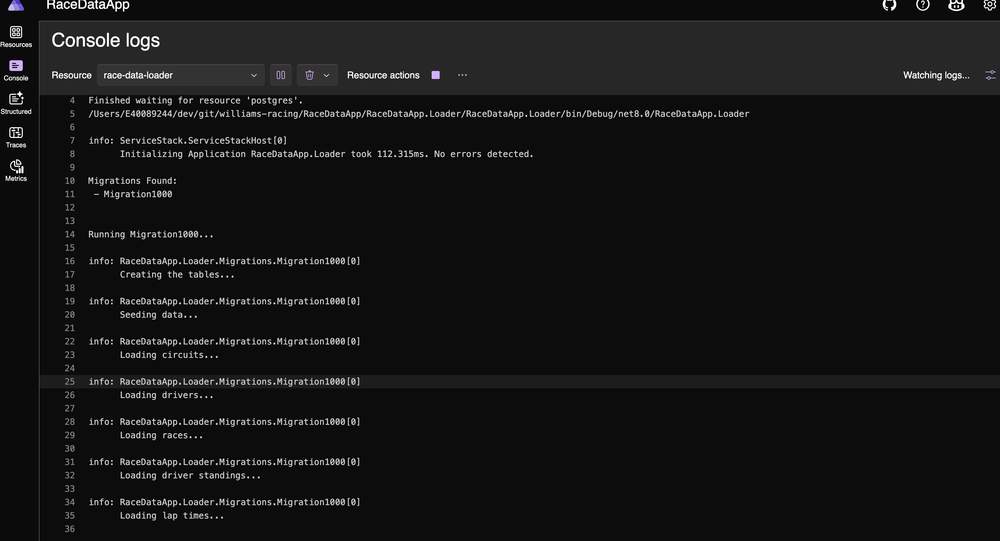
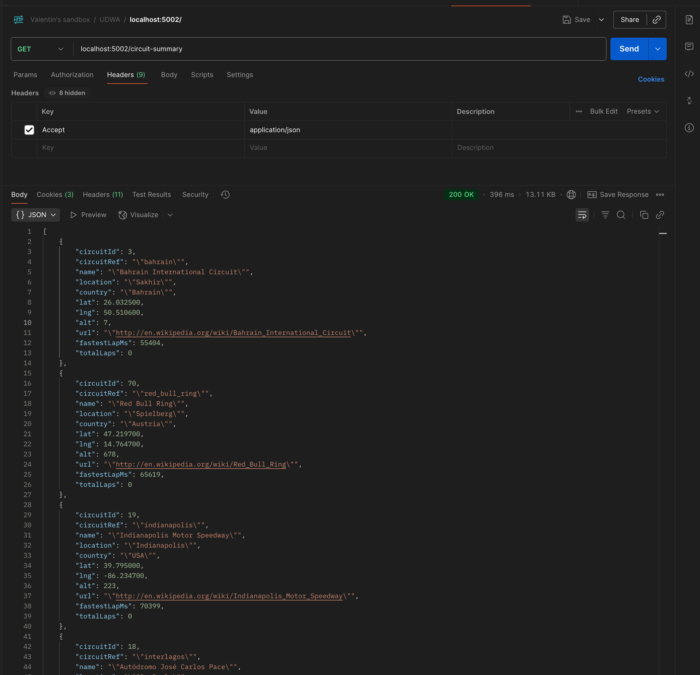
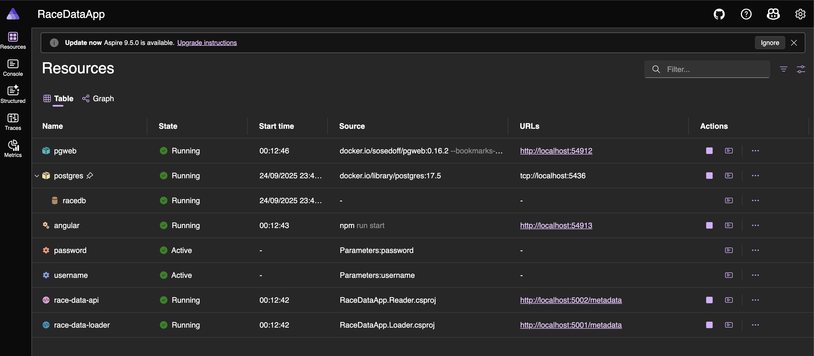
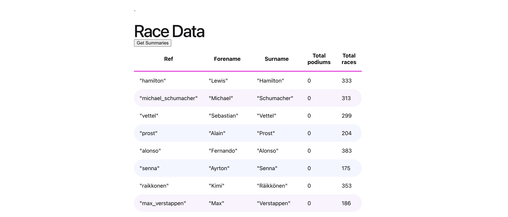

# williams-racing

## Prerequisites

- net8 SDK
- Docker daemon running (e.g. via Docker Desktop. Aspire requires it)

## Prep before running

There's a little Angular web frontend in this solution. Aspire won't install the npm packages automatically so you have to 

```
cd RaceDataApp/RaceDataApp.Ui
npm install
```

## How to run 

Open up the `RaceDataApp.sln`

`RaceDataApp.AppHost` is the Aspire orchestrator, which will spin up all the services. THe first time you run it, it will take quite abit of time for the data to be persisted to the DB.

The Aspire dashboard should pop up and you can view the different resources in there.



you can click on pgweb to view the data (once it's loaded - it will take some time). Select `racedb` and click Connect



Once the migration has completed, it should look like this:



You can view logs for each of the services, like so:



There is an API with two endpoints exposed on port `:5002`

- localhost:5002/circuit-summary
- localhost:5002/driver-summary

for, respectively:
- A summary per circuit including circuit details, fastest lap across all races and total races completed.
- A summary per driver including number of times they have been on the podium and the total number of races entered.

When calling via e.g. Postman make sure you add the following header

`Accept: application/json`

otherwise the output will look :poo:

Here's an example of what the query returns



Also available via the Aspire dashboard is the web frontend:



which should pop open the Angular app (this is directly taken from [one of these samples](https://github.com/dotnet/aspire-samples/tree/main))


...from which I've exposed one of the two endpoints above to retrieve driver summaries, which you can load up to screen by clicking the button:




## Design

I've used ServiceStack to design the backend. No good reasons, I just used it before and could move pretty quickly with it. 
Given the time constraints I have, I went with it (I would actually not recommend anyone using ServiceStack.. it's nice 
and all but poorly documented and run by one guy)

There are two services:
- The `RaceDataApp.Loader` - basically it's just a migration script, it loads up the CSV data and insert it into Postgres. I could've made this a simple console app but thought I was going to add endpoints on the ingestion end... then I didn't have time to change it to a console app... so it's a web app now.. oh well
- The `RaceDataApp.Reader` - that's the API, it's got 2 methods to return
   - A summary per circuit including circuit details, fastest lap across all races and total races completed.
   - A summary per driver including number of times they have been on the podium and the total number of races entered.
- The `RaceDataApp.Ui` - an _extremely bare bone_ frontend, that's just an Angular app that talks to the `Reader` service.
- The `RaceDataApp.AppHost` is the Aspire service that bundles everything up together

ALl of this is orchestrated together by `Aspire` (it's a Docker compose++ basically). This will spin up the Postgres database for you in a Docker container, as well as the other 2 services (and the frontend)


## Improvements

- It's taking ages to load up the `lap_time` (a few minutes), There are ways of making this faster but I ran out of time (e.g. removing all the constraints such as primary and foreign keys before inserting the data.. add the constraints once all data is loaded OR use `COPY`)

This is the time it's taken on my machine:

`Completed Migration1000 in 272.944s`

- In the items returns by driver-summary, there's a small issue how the datetime is deserialized for the `dob` field

```json
{
        "driverId": 1,
        "driverRef": "\"hamilton\"",
        "forename": "\"Lewis\"",
        "surname": "\"Hamilton\"",
        "dob": "0001-01-01T00:00:00",
        "nationality": "\"British\"",
        "totalPodiums": 0,
        "totalRaces": 333
    }
```

- In the `RaceDataApp.Reader` (the API) I added super permissive CORS policy that I would obviously have to rework if that were prod software (I did this for the angular app to be able to talk to the backend, since Aspire was generating a new port each time, I couldn't easily add a known list of `allowedOrigins`)

Still in the migration script, all the `Load...` methods could be made mostly generic.

`LoadItems<T>(string filename)`

I started adding builders for each of the DB entities `IBuilder<T>` but ended up not using it

In pseudo-code, I wanted to do something like this:

```csharp
private void LoadItems<T>(string filename, string itemtype) 
    {
        _logger.Info($"Loading {itemtype}...");
        var builder = builderFactory.Get(itemtype);
        using var reader = new StreamReader(filename);
        var headerLine = reader.ReadLine(); // skip the header
        if (headerLine == null) return; //probably throw?

        var entities = new List<T>();
        while (!reader.EndOfStream)
        {
            var line = reader.ReadLine();
            if (string.IsNullOrWhiteSpace(line))
            {
                continue;
            }

            try
            {
                entities.Add(builder.FromRow(line).Build());
            }
            catch (Exception e)
            {
                _logger.Error($"Error parsing lap times... {line} with exception {e.Message}");
                throw; //Stop the migration and everything
            }

            if (entities.Count >= BatchSize)
            {
                _logger.Info($"Batch size is reached. Inserting {BatchSize} items");
                Db.InsertAll(entities);
                entities.Clear();
            }
        }
        
        Db.InsertAll(entities); //Save the remaining
    }
```

There are no tests right now. I know... 